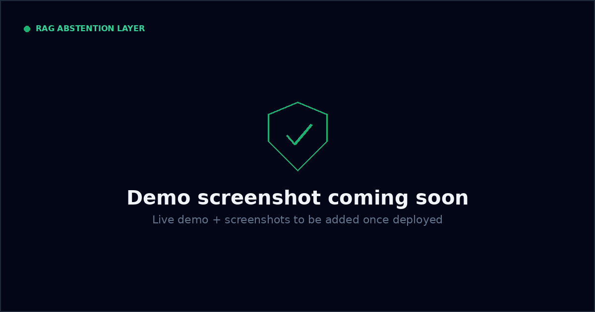
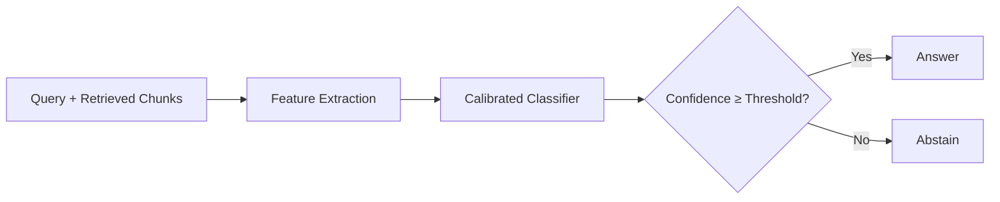
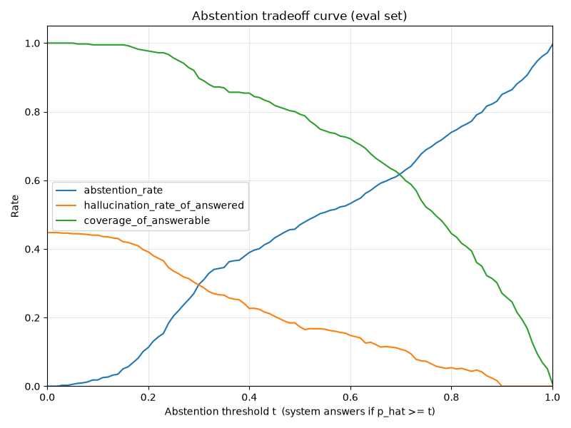

# RAG Abstention Layer

**Stop your RAG system from hallucinating. A pip-installable middleware that knows when to say "I don't know."**

<table>
<tr>
<td align="center">🎯<br><b>45% → 17%</b><br><sub>hallucination rate</sub></td>
<td align="center">✅<br><b>79%</b><br><sub>answer coverage retained</sub></td>
<td align="center">🛡️<br><b>0%</b><br><sub>hallucinations at strict threshold</sub></td>
</tr>
</table>

## What it does

Your RAG pipeline retrieves context and feeds it to an LLM. Sometimes the
retrieved context doesn't actually contain the answer — but the LLM
generates a confident-sounding response anyway. This middleware sits
between retrieval and generation, scores the quality of retrieved
evidence, and abstains when the evidence isn't strong enough. **79%** of
genuinely answerable questions still get answered; the ones that don't
have a real answer get caught instead of hallucinated.

## Demo

🔗 **[Live Demo](https://site-taahknc89-shivanshs-projects-64404921.vercel.app)** — try it with your own questions



## Quickstart

```bash
pip install rag-abstention
```

```python
from rag_abstention import AbstentionScorer

scorer = AbstentionScorer(threshold=0.5)
result = scorer.score(
    question="Who built the Eiffel Tower?",
    retrieved_chunks=["The Eiffel Tower was designed by Gustave Eiffel..."]
)

if result.should_abstain:
    print("I don't have enough information to answer that.")
else:
    print(f"Confident enough to answer (confidence: {result.confidence:.2f})")
```

## How it works



Three feature groups feed the classifier:

- **Reranker relevance** — cross-encoder scoring whether each chunk actually answers the query (dominant signal)
- **Embedding diversity** — chunk redundancy and topical relevance
- **Entity coverage** — named entity overlap between query and chunks

Trained on synthetically corrupted HotpotQA data with three corruption
types. The classifier outputs a calibrated probability — you set the
threshold based on your risk tolerance.

## The tradeoff curve



Higher threshold = fewer hallucinations but more abstentions. Pick your operating point.

| Setting | Threshold | Hallucination Rate | Answer Coverage |
|---|---|---|---|
| Balanced | **0.50** | **17.3%** | **79.3%** |
| Conservative | **0.73** | **7.9%** | **57.0%** |
| Zero hallucination | **0.90** | **0.0%** | **27.1%** |

## Integration

```python
@abstention_guard(threshold=0.6,
    on_abstain=lambda q: "I don't have enough information.")
def answer_question(question, chunks):
    return your_llm.generate(question, chunks)
```

LangChain and LlamaIndex adapters coming soon.

## Project structure

```
rag-abstention-layer/
├── src/
│   ├── abstention_data/       # synthetic HotpotQA corruption pipeline
│   ├── abstention_features/   # reranker, diversity, entity-coverage feature extraction
│   └── abstention_model/      # training, calibration, evaluation
├── api/                        # FastAPI live-scoring service
├── site/                       # Vite + React + Tailwind demo site
├── scripts/                    # CLIs: generate data, extract features, train, diagnose
├── tests/                      # 188+ fast tests, plus @pytest.mark.slow real-model tests
├── docs/                       # phase-by-phase engineering writeups
└── artifacts/                  # generated models/eval outputs (gitignored)
```

> The `rag_abstention` pip package shown above is the packaging target for
> this project — it wraps `api/`'s scoring logic (`abstention_features` +
> `abstention_model`) into an installable library. Not yet published; the
> live scoring today runs through `api/`.

## Development

**Prerequisites:** Python 3.12 (scikit-learn's pin requires ≥3.11), plus a one-time spaCy model download.

```bash
uv sync --extra dev                        # or: pip install -e ".[dev]"
python -m spacy download en_core_web_sm
```

**Run tests:**

```bash
pytest -v -m "not slow"    # fast suite (no model downloads) — 188 passed
pytest -v                  # full suite, including real-model integration tests
```

**Run the demo site locally, with live scoring:**

```bash
# Terminal 1
cd api && pip install -r requirements.txt --extra-index-url https://download.pytorch.org/whl/cpu
python -m spacy download en_core_web_sm
uvicorn app:app --reload

# Terminal 2
cd site && npm install && npm run dev
```

See [`site/README.md`](site/README.md) for details and deployment notes.

## Key findings

The interesting part of this project isn't the final model — it's what
didn't work first:

- **Entailment-based NLI features (the textbook approach) contributed
  near-zero signal.** Question-as-hypothesis framing doesn't hold up for
  RAG abstention — a question isn't a proposition, so there's no
  coherent sense in which a passage "entails" one.
- **A query-passage reranker (MS MARCO) replaced NLI and became the
  dominant feature** — more important than all four other features
  combined.
- **Synthetic "truncated span" corruption (answer sentence surgically
  removed) turned out too hard/artificial** — the model can't reliably
  distinguish it from genuine gold passages, and real RAG failures don't
  usually look like that.
- **Clean-case AUC rose from 0.67 to 0.86 through feature engineering
  and data curation, not hyperparameter tuning** — hyperparameters were
  never touched.

Full write-up: [`docs/phase3_evaluate.md`](docs/phase3_evaluate.md) and [`docs/phase4_diagnosis.md`](docs/phase4_diagnosis.md).

## Tech stack


## License

MIT — see [LICENSE](LICENSE).

## Author

**Shivansh** — [GitHub](https://github.com/Shivansh1205) · [LinkedIn](https://linkedin.com/in/your-profile)
